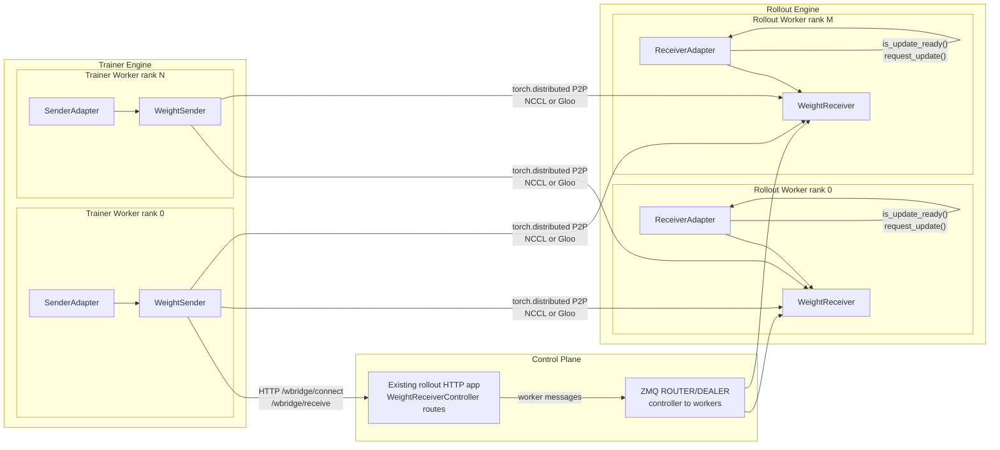

# Architecture

WeightBridge Library is organized across three planes:

- **Data Plane**: moves tensor bytes from Trainer Workers to Rollout Workers.
- **Metadata Plane**: describes how framework parameters map to HuggingFace checkpoint tensors.
- **Control Plane**: coordinates engines, workers, connection setup, and update timing.



## Data Plane

The Data Plane uses a 5-stage pipeline:

```text
Save(Translate) -> Split -> P2P Transfer -> Merge -> Load(Translate)
```

- **Save(Translate)** copies sender runtime parameters into HuggingFace-side shard buffers according to the sender `LoadSpec`.
- **Split** partitions each sender buffer into the overlaps needed by receiver ranks.
- **P2P Transfer** exchanges flat byte chunks with `torch.distributed.batch_isend_irecv`.
- **Merge** reconstructs receiver-side buffers from the chunks sent by trainer ranks.
- **Load(Translate)** copies merged buffers into rollout runtime parameters according to the receiver `LoadSpec`.

`WeightRouter` compares sender and receiver `ShardSpec`s, computes overlaps, and schedules communication rounds. In `gpu_direct` mode it uses NCCL and CUDA communication buffers. In `cpu_direct` mode it uses Gloo and CPU wire buffers while model parameters still live in GPU runtime tensors.

## Metadata Plane

The Metadata Plane makes P2P routing configuration-agnostic.

`LoadSpec` records how HuggingFace checkpoint tensors map into runtime worker tensors. It can represent common loader transformations such as QKV merge, gate/up merge, row-parallel slices, column-parallel slices, and vocab slices.

WeightBridge infers a `LoadSpec` by symbolically probing an existing framework `load_weights` function. During inference, it feeds identifiable placeholder tensors through the loader, observes which worker tensors change, and records source and destination regions.

`ShardSpec` is the storage-free view derived from `LoadSpec`. It describes which HuggingFace-side tensor regions a process owns or needs. WeightBridge computes overlaps between sender and receiver `ShardSpec`s to decide who talks to whom.

## Control Plane

The Control Plane gives the Trainer Engine and Rollout Engine a common update protocol.

- `WeightReceiverController` registers HTTP routes used by sender rank 0, preferably on the Rollout Engine's existing app.
- The controller talks to local Rollout Workers through ZMQ.
- `ReceiverAdapter` initializes receiver-side metadata and owns a `WeightReceiver`.
- `SenderAdapter` initializes sender-side metadata and owns a `WeightSender`.
- Trainer Workers call `connect()` once, then `send_weights()` for each update.
- Rollout Workers poll `is_update_ready()` from their scheduler or event loop, then call `request_update()` only when an update is ready.

In Sync mode, rollout loading is part of the weight update barrier. In Async mode, sending can return after weights are offloaded, and Rollout Workers load the update when it becomes ready through `is_update_ready()` and `request_update()`.
